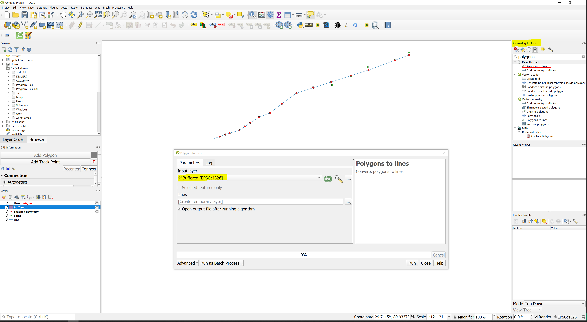

# Tasks_Automation
This project demonstrates various task automation techniques using tools like PyQGIS, the graphical modeler, ArcPy, ModelBuilder, FME, and more. I'll also share some tasks done using QGIS &amp; ArcGis.
---
# Tables of contents
- [1 -  How to Split a Line Layer Using a Point Layer in QGIS ?](#section1)
---

# 1 -  How to Split a Line Layer Using a Point Layer in QGIS ?
The goal is to split the line at each point. The challenge is that some points don't intersect the line. 

To split the line, you can follow this step : 
- **Using QGIS** : 
    - Use the tool "Snap geometries to layer" from the processing toolbox. You need to set the parameter as show in the image. This will create a new point layer where all the point intersect the line layer. 
    
    - Create a small buffer from point layer. Note that the layer unit is in degree. 
    
    - Convert buffer (polygon) to line : You can use the tool "Polygons to lines" from the processing Toolbox. 
    
    - Use the tool "Split with lines" from the processing toolbx. This will split Line layer every where we have a point layer (buffer --> line). 
    
    - This is the result 
    
- **Using Graphical Modeler** : You can go to the menu Processing --> Graphical modeler. The model will appear. After that you can go to Model --> Open model. You can load the [model](Result/Split_line_with_point.model3). 

- **Using PyQGIS** : You can open the [code](Result/Split_line_with_point.py) in the python console
